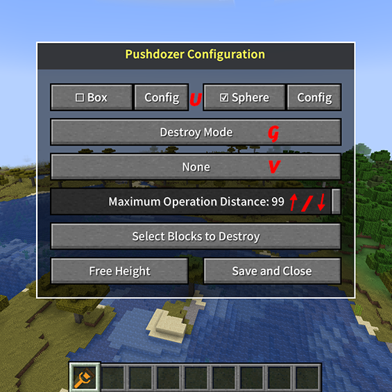

# Getting Started

## 2.1 Installation & Configuration
2.1.1 Make sure you have:
   - Installed [Fabric Mod Loader](https://fabricmc.net/use/) (version >= 0.15.0)
   - Downloaded and installed [Fabric API](https://www.curseforge.com/minecraft/mc-mods/fabric-api)
   - Downloaded the latest version of Pushdozer from the [releases page](https://github.com/theopote/pushdozer/releases)
   - Put the downloaded JAR file into `.minecraft/mods` folder
   - Launch Minecraft and enjoy Pushdozer!

2.1.2 First Use Steps:
   - After launching the game, find the Pushdozer tool icon in creative mode utilities and select it.
   - When holding Pushdozer, press `K` to open Pushdozer configuration interface (key can be modified):
   
   

## 2.2 Basic Controls
Shortcuts can be modified in Minecraft settings.
- `K`: Open/Close configuration interface (must be holding Pushdozer tool)
- `U`: Toggle brush shape (Cuboid/Sphere)
- `G`: Toggle work mode (Destroy/Place/Smooth)
- `V`: Toggle display mode (Wireframe/Surface/No display)
- `Ctrl+Z`: Undo last operation
- `Ctrl+Y`: Redo operation
- `↑/↓`: Increase/Decrease operation range (maximum distance player can operate)

