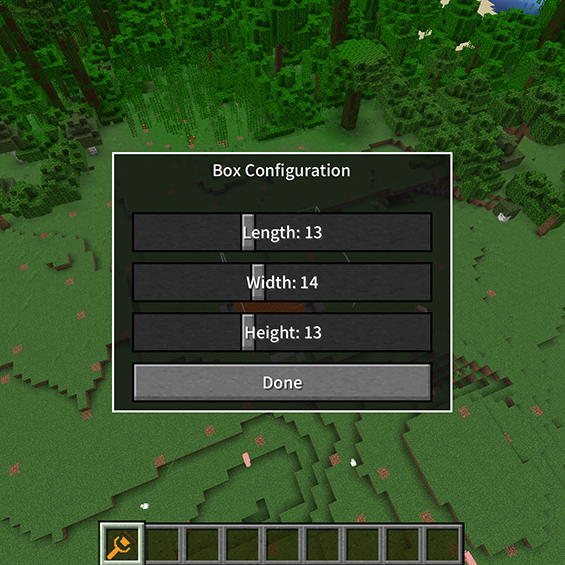
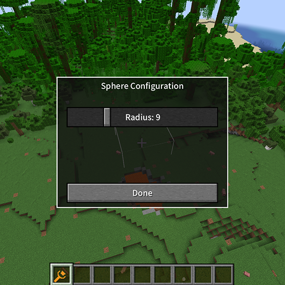

# Brush Shapes

## Cuboid

3.3.1 Size Adjustment:
   - Length: 1-32 blocks
   - Width: 1-32 blocks
   - Height: 1-32 blocks
   
   

3.3.2 Usage Tips:
   - Perfect for creating regular building foundations
   - Used for excavating underground spaces
   - Create perfect rectangular terrain

## Sphere
3.3.3 Parameter Settings:
   - Radius range: 1-32 blocks
   
   

3.3.4 Applications:
   - Create natural hills
   - Dig caves
   - Smooth terrain transitions