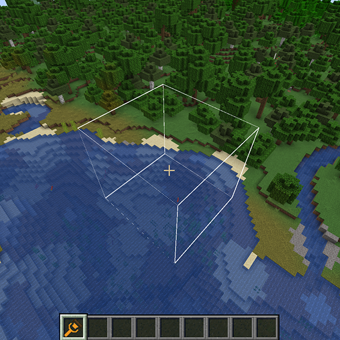

# Display Modes

3.2.1 Wireframe Mode:
   - Clearly shows operation range boundaries
   - Low performance impact, suitable for low-end computers
   - Perfect for precise operations and building alignment
   - Use `V` key to quickly switch to this mode
   
   

3.2.2 Surface Mode:
   - Intuitively displays affected area surface
   - Suitable for large-scale terrain modifications
   - Easy to preview final results
   - Uses transparency to show overlapping areas
   - Press `V` key to switch to this mode
   
   

3.2.3 No Display Mode:
   - Best performance
   - Suitable for experienced users
   - Useful for video recording without visual interference
   - Press `V` key again to switch to this mode

3.2.4 Mode Switching Tips:
   - Use surface mode for precise building
   - Use wireframe mode for terrain shaping
   - Use no display mode after familiarization
   - Choose appropriate mode based on computer performance