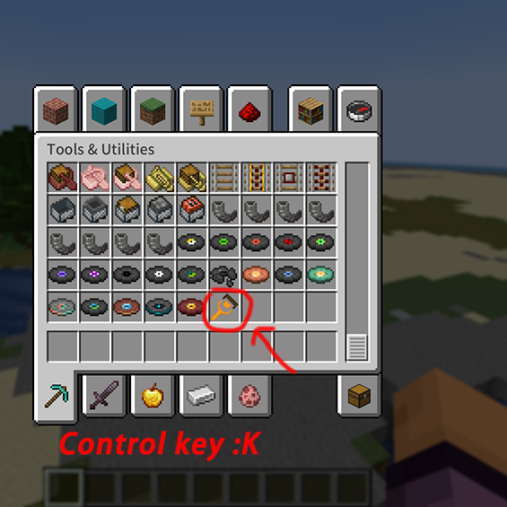
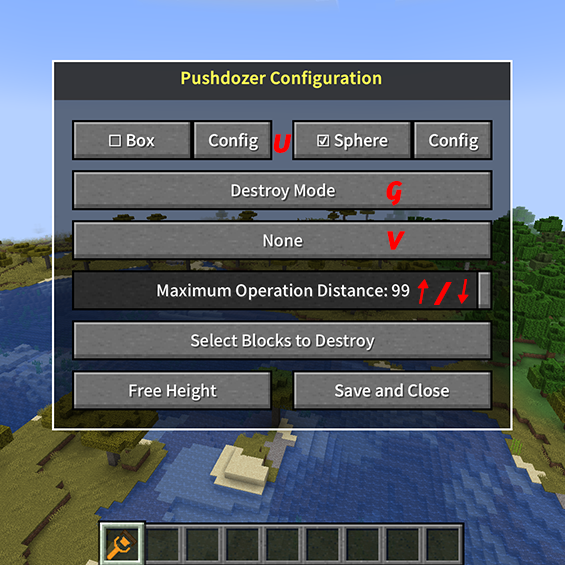

# 入门指南

## 2.1 安装配置
2.1.1 确保你已经安装了：
   - 安装 [Fabric 模组加载器](https://fabricmc.net/use/) (版本 >= 0.15.0)
   - 下载并安装 [Fabric API](https://www.curseforge.com/minecraft/mc-mods/fabric-api)
   - 从[发布页面](https://github.com/theopote/pushdozer/releases)下载最新版本的 Pushdozer
   - 将下载的 JAR 文件放入 `.minecraft/mods` 文件夹
   - 启动 Minecraft 并享受 Pushdozer！

2.1.2 首次使用步骤：
   - 启动游戏后，在创造模式物品栏实用工具中找到Pushdozer工具图标并且选取。
   - 当玩家手持Pushdozer时，按下`K`键打开Pushdozer配置界面(快捷键可修改)：
   
   

## 2.2 基础快捷键
快捷键可以在minecraft的设置中进行修改。
- `K`: 打开/关闭配置界面(需要玩家手持Pushdozer工具)
- `U`: 切换笔刷形状（长方体/球形）
- `G`: 切换工作模式（破坏/铺设/平滑）
- `V`: 切换显示模式（线框/表面/无显示）
- `Ctrl+Z`: 撤销上一步操作
- `Ctrl+Y`: 重做操作
- `↑/↓`: 增加/减少操作范围（玩家可操作的最远距离）

