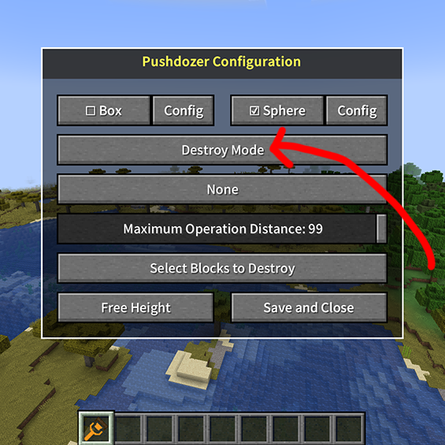
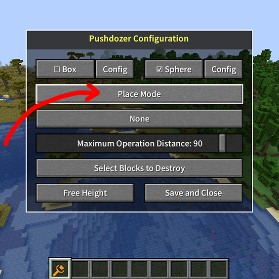
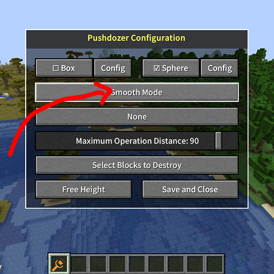

# 工具模式详解

3.1.1 破坏模式:
   - 按`G`键循环切换至破坏模式
   - 右键点击开始破坏区域
   - 可通过配置界面设置忽略的方块类型（选择允许破坏的方块按钮）
   - 使用锁定高度功能破坏某一确定标高之上的方块
   
   

3.1.2 铺设模式:
   - 按`G`键循环切换至铺设模式
   - 右键点击开始放置方块
   - 会自动根据生物群落来自动选择填充地形的方块
   - 使用锁定高度功能创建某一确定标高的平整地形
   
   

3.1.3 平滑模式:
   - 按`G`键循环切换至平滑模式
   - 右键点击拖动来平滑地形
   - 使用不同大小的范围获得不同的平滑效果

   
