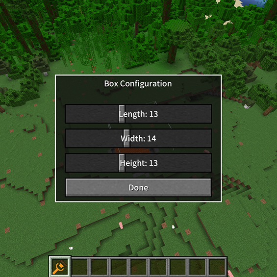
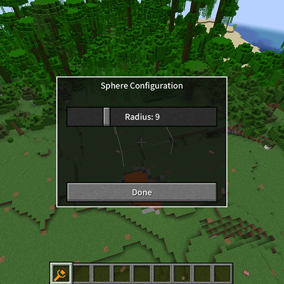

# 笔刷形状

## 长方体

3.3.1 尺寸调整：
   - 长度：1-32格
   - 宽度：1-32格
   - 高度：1-32格
   
   

3.3.2 使用技巧：
   - 适合创建规则的建筑基础
   - 用于挖掘地下空间
   - 创建完美的矩形地形

## 球形
3.3.3 参数设置：
   - 半径范围：1-32格
   
   

3.3.4 应用场景：
   - 创建自然山丘
   - 挖掘洞穴
   - 平滑地形过渡 