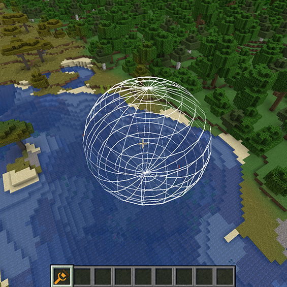
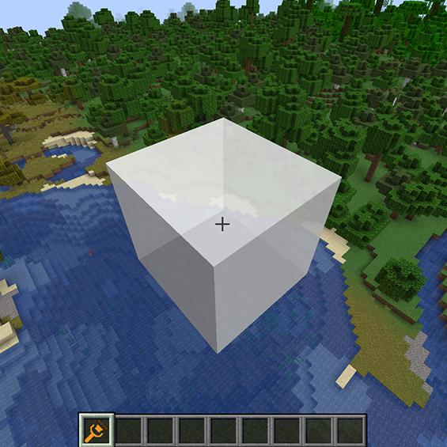
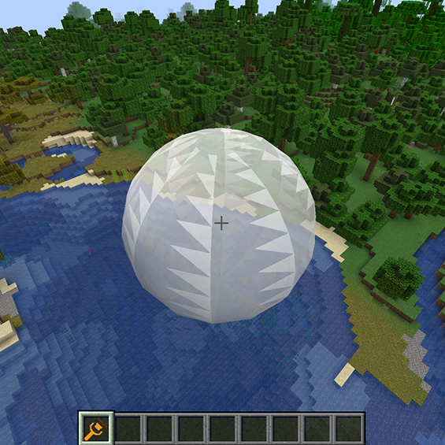

# 显示模式详解

3.2.1 线框模式：
   - 清晰显示操作范围边界
   - 低性能消耗，适合低配置电脑
   - 适合精确操作和建筑对齐
   - 使用`V`键快速切换至此模式
   
   

3.2.2 表面模式：
   - 直观显示影响区域表面
   - 适合大范围地形修改
   - 方便预览最终效果
   - 使用半透明效果展示重叠区域
   - 按`V`键切换至此模式  
   
   

3.2.3 无显示模式：
   - 最优性能表现
   - 适合熟练用户快速操作
   - 用于录制视频时去除视觉干扰
   - 再次按`V`键切换至此模式

3.2.4 模式切换技巧：
   - 在精确建造时使用表面模式
   - 地形塑造时使用线框模式
   - 熟悉操作后可使用无显示模式
   - 根据电脑性能选择合适模式 